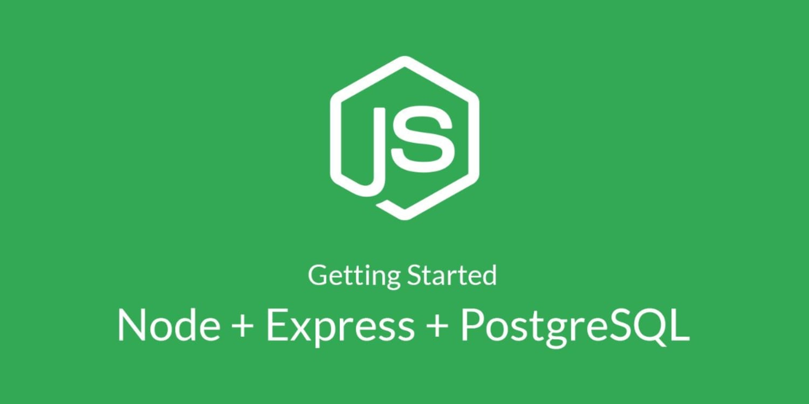

  

# Node permission server

É o backend de uma aplicação onde o principal objetivo é o cadastramento de produtos e utiliza o conceito de roles, onde há algumas funções específicas ao administrador e aos usuários comuns. Foi desenvolvido utilizando nodejs, express, postgres e typescript.

Neste projeto foi utilizado:

- autenticação por jwt
- migrations
- seed (inserção de dados, antes de desenvolver qualquer interface)
- roles (usuários diferentes, como: administrador e usuário comum)

Este backend foi feito a partir de um video tutorial da Daniele Evangelista, que é uma das programadoras que trabalha na rocketseat.
[Tutorial](https://www.youtube.com/watch?v=TGCwB9oMR0o)

> Status do Projeto: Concluido :heavy_check_mark:

>> Esse projeto está sob a licença MIT. Veja o arquivo [LICENSE](https://github.com/Matheus-SS/node-permission-server/blob/master/LICENSE) para mais detalhes.